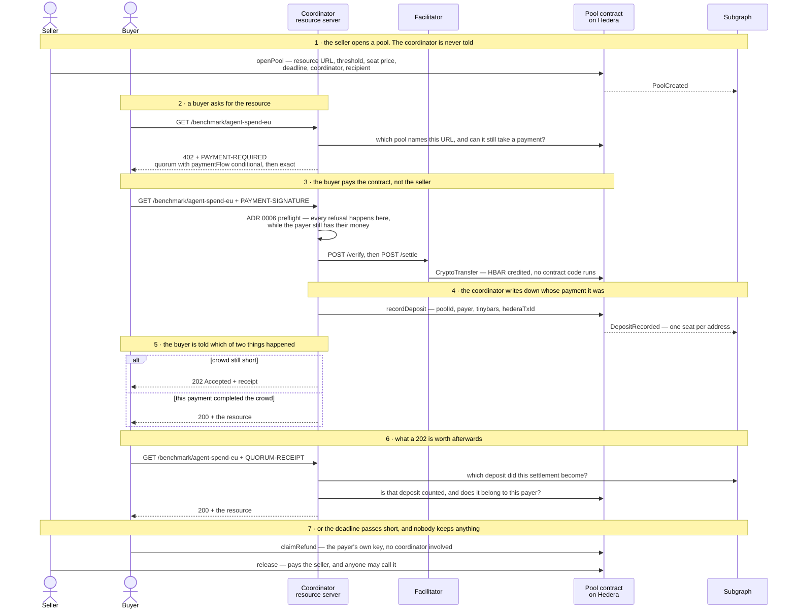

# quorum402

[](https://github.com/lxfoundry/quorum402/actions/workflows/ci.yml)

An HTTP 402 challenge that a crowd can answer together.

Funds are held, and the resource unlocks only if enough separate buyers pay before the
deadline. If the threshold is not reached, everyone is refunded.

Built from scratch for [ETHOnline 2026](https://ethglobal.com/events/ethonline2026)
(Classic / "From Scratch" track).

> 🚧 Status: in active development. Anything marked `TODO` below is a placeholder, not a claim
> that something works.

---

## The gap this fills

[x402](https://x402.org) turns HTTP `402 Payment Required` into a real payment handshake.
As of 2026-09-08 its schemes all describe one payer settling one request:

| Scheme | Semantics |
|---|---|
| `exact` | Buyer authorises the advertised amount |
| `upto` | Buyer authorises a ceiling; seller settles actual usage |
| `batch-settlement` | One buyer's repeated micropayments accumulate against a reusable channel |
| `auth-capture` | Buyer's funds are held, then captured or released at the seller's discretion |

None of them expresses "I will pay if enough others do." That is a different shape: many
distinct payers, one resource, an all-or-nothing outcome, and a refund path when the crowd does
not show up. `auth-capture` comes closest and still cannot, because its release is the seller's
choice, not a fact about who else turned up.
[The scheme spec §1](specs/quorum-scheme.md#1-what-x402-does-not-express-as-of-2026-09-08) makes
that comparison precisely.

`quorum402` proposes that missing shape as a scheme named `quorum`. What is built of it is
stated per hold binding in [§10](specs/quorum-scheme.md#10-hold-bindings).

The same mechanism covers minimum-participant offers (a trip that runs at 20 travellers),
tiered group buying (the price falls as the pool fills), and all-or-nothing crowdfunding.

---

## How it works

A seller opens a pool over a resource. Buyers arrive at that resource one at a time and
independently, and no buyer knows about the others: the crowd is assembled by the thing being
sold, not by anyone organising it.

The seven steps below are the seven labelled in the diagram. Every refusal, and the order they
run in, is in [§6.2](specs/quorum-scheme.md#62-the-payment-leg-as-built) and
[§8.1](specs/quorum-scheme.md#81-redemption-as-built).



1. The seller opens a pool, on-chain, and the coordinator is not told. The pool records the
   resource URL it sells, the threshold, the seat price, the deadline, the coordinator allowed to
   record payments into it, and the account the money goes to if it fills
   ([ADR 0003](specs/adr/0003-pool-authority-model.md)). The server learns the pool exists by
   reading the chain, the same way anyone else would. It keeps no database, so what is for sale
   is whatever the chain currently says is for sale.
2. A buyer `GET`s the resource and is answered `402 Payment Required`. The `PAYMENT-REQUIRED`
   header carries two offers: `quorum`, declaring `paymentFlow: conditional`, the threshold, how
   many seats are already taken and the deadline; then plain `exact`, so a client that has never
   heard of this scheme can still pay.
3. The buyer pays the contract, not the seller. `payTo` is the pool contract's own Hedera id, so
   the money lands in the contract's account and nobody holds it on the way. The payment is a
   native `CryptoTransfer`, which runs no contract code, so the contract cannot refuse it and
   cannot fail on receipt
   ([ADR 0004](specs/adr/0004-deposits-that-cannot-be-refused.md)). The facilitator verifies the
   payload, pays the gas and submits it.
4. The coordinator records the deposit in a second transaction, crediting one seat to the payer's
   address, [`QuorumPools.sol:226`](contracts/QuorumPools.sol#L226). One seat per address, so a
   payer cannot fake a crowd by paying twice. Because the money moves before the contract hears
   about it, attribution is a trust boundary rather than an arithmetic problem, and
   [ADR 0002](specs/adr/0002-payment-attribution-on-hedera.md) is where that cost is accounted
   for. The server checks that this step *can* succeed before it settles anything: a refusal
   before `/settle` costs the payer nothing, and a refusal after it costs them the payment
   ([ADR 0006](specs/adr/0006-nothing-settles-until-recording-can-succeed.md)).
5. The buyer is told which of the two things just happened. Threshold not yet met: `202
   Accepted`, with a receipt naming the seat, the fill and the deadline. Threshold met by *this*
   payment: `200`, with the resource. Every other outcome is in
   [§6](specs/quorum-scheme.md#6-lifecycle).
6. A `202` becomes the resource once the crowd arrives. The buyers who paid before the threshold
   was crossed hold a receipt instead of the thing they bought, and nothing was remembered on
   their behalf: the coordinator keeps no session and no account of who is owed what. A payer
   signs the [§8](specs/quorum-scheme.md#8-entitlement-and-redemption) canonical message with the
   account that paid and presents it as `QUORUM-RECEIPT`. The coordinator resolves that
   settlement through the index, confirms with the contract that the deposit is counted and
   belongs to that account, and serves the resource. Entitlement is derived from chain state
   every time it is asked for, so a receipt keeps working across restarts, redeployments and a
   coordinator that has never heard of you.
7. If the deadline passes with the pool short, everyone is refunded, and not by the coordinator.
   A payer who can afford the gas calls [`claimRefund`](contracts/QuorumPools.sol#L336) with
   their own key and needs nobody; a payer who cannot has
   [`refundAll`](contracts/QuorumPools.sol#L381) push it to them, called by a bystander who gains
   nothing by doing it. [§9](specs/quorum-scheme.md#9-reversal) puts reversal outside HTTP on
   purpose: the party a payer most needs protection from is the one that failed to sell them the
   thing.

### The same seven steps, actually run

Every command below was run against the hosted coordinator
<https://quorum402-coordinator.fly.dev> on 2026-09-10, and every output is what came back.
Nothing here is illustrative. The run filled pool 21, which is terminal now, so the index
answers for it exactly as it did during the run: the links go to the subgraph's own GraphiQL, and
you can re-run each query yourself without a wallet, a clone, or anything installed.

The endpoint is currently selling pool 25, open until 2026-10-10: the same seven steps, still
payable, by anyone with three funded testnet accounts.

#### 1 · the seller opens a pool

The seller's action, and the only one that touches no server. `PUBLIC_BASE_URL` is what the pool
records on-chain as the resource it sells, so it has to be the origin that will answer for it:

```bash
PUBLIC_BASE_URL=https://quorum402-coordinator.fly.dev \
  npm run pool:open -- --slug agent-spend-eu --recipient seller --ttl 2592000
```

```
pool 25 open on hedera:testnet

  benchmark    agent-spend-eu-2026w37
  resource     https://quorum402-coordinator.fly.dev/benchmark/agent-spend-eu
  seat price   100000000 tinybars
  threshold    3 distinct buyers
  deadline     2026-10-10T16:53:10.000Z (2592000s)
  coordinator  0.0.10404217  0xd71c8866104211a296ddb08b76d501a4096ac0cd
  recipient    0.0.10434989  0x00000000000000000000000000000000009f39ad
  contract     0.0.10409980
  created by   0.0.10404217@1789059184.694498311  (168143 gas)
```

Observe it: [pool 25 in the index](https://quorum402-subgraph.fly.dev/subgraphs/name/quorum402/graphql?query=%7B%0A%20%20pool%28id%3A%20%2225%22%29%20%7B%0A%20%20%20%20poolId%0A%20%20%20%20state%0A%20%20%20%20seats%0A%20%20%20%20threshold%0A%20%20%20%20unitTinybars%0A%20%20%20%20deadline%0A%20%20%20%20resourceUrl%0A%20%20%20%20recipient%0A%20%20%20%20coordinator%0A%20%20%7D%0A%7D) reads `state: Open`, `seats: 0`, and the
`resourceUrl` the coordinator will match requests against. The pool exists because the seller put
it on the chain; the coordinator has still not been told anything, and will find it on its next
read.

#### 2 · a buyer asks, and is told the price of a crowd

No key, no clone, no wallet. This one you can run right now:

```bash
curl -si https://quorum402-coordinator.fly.dev/benchmark/agent-spend-eu
```

`402 Payment Required`, and the decoded `PAYMENT-REQUIRED` header (the one-liner that decodes it
is under [The 402 itself](#the-402-itself)) carried, at the time of this run:

```jsonc
"accepts": [
  { "scheme": "quorum", "network": "hedera:testnet",
    "amount": "100000000", "asset": "0.0.0", "payTo": "0.0.10409980",
    "extra": { "paymentFlow": "conditional", "poolId": "21", "threshold": 3,
               "filled": 0, "deadline": 1789406664,
               "binding": { "scheme": "exact", "extra": { "feePayer": "0.0.7162784" } } } },
  { "scheme": "exact",  "network": "hedera:testnet", /* … the same seat, payable by a client
                                                        that has never heard of `quorum` */ }
]
```

The `error` field alongside it is not an error in the usual sense. It is the offer stated in
words, because a buyer that pays without reading it has misunderstood what it bought:

> This resource is sold to a group. Payment is held and the resource unlocks only if 3 distinct
> payers pay before the deadline; if they do not, every payer is refunded and the resource is
> never served. Paying does not by itself buy access.

#### 3–4 · the buyer pays, and the coordinator writes down whose payment it was

One command, because a buyer performs them as one HTTP exchange: it re-requests the resource with
`PAYMENT-SIGNATURE`, the coordinator runs the ADR 0006 preflight, relays `/verify` and `/settle`,
and records the deposit before answering.

```bash
PUBLIC_BASE_URL=https://quorum402-coordinator.fly.dev npm run buy -- agent-spend-eu buyer1
```

```
  signed       0.0.7162784@1789059208.972005265
  answered     202
```

That transaction id is the payment on Hedera. Paste it into
[HashScan](https://hashscan.io/testnet) and the transfer is there, credited to the contract
`0.0.10409980` and not to any person.

#### 5 · two buyers are told to wait, and the third is served

`buyer1` and `buyer2` each got a 202 and a receipt. This is `buyer1`'s, unedited:

```json
{
  "poolId": "21",
  "payer": "0x00000000000000000000000000000000009f39a3",
  "transaction": "0.0.7162784@1789059208.972005265",
  "attributed": true, "counted": true,
  "seat": 1, "threshold": 3, "deadline": 1789406664,
  "pool": { "state": "Open", "filled": 1 },
  "next": [
    { "action": "redeem",  "when": "threshold met",   "header": "QUORUM-RECEIPT" },
    { "action": "reclaim", "when": "deadline passes", "contract": "0.0.10409980",
      "method": "claimRefund(uint256)" }
  ]
}
```

Observe it, between the second and third seat: [pool 21's deposits](https://quorum402-subgraph.fly.dev/subgraphs/name/quorum402/graphql?query=%7B%0A%20%20pool%28id%3A%20%2221%22%29%20%7B%0A%20%20%20%20state%0A%20%20%20%20seats%0A%20%20%20%20threshold%0A%20%20%20%20committedTinybars%0A%20%20%20%20deposits%20%7B%0A%20%20%20%20%20%20hederaTxId%0A%20%20%20%20%20%20payerAddress%0A%20%20%20%20%20%20counted%0A%20%20%20%20%20%20seatsAfter%0A%20%20%20%20%20%20tinybars%0A%20%20%20%20%7D%0A%20%20%7D%0A%7D). Three rows now;
there were two at that moment, `seats: 2`, `committedTinybars: 200000000`, and three distinct
`payerAddress` values, which is the whole claim the threshold makes, readable straight off the
index.

`buyer3` ran the identical command and got 200, with the resource itself and not a receipt:

```json
{
  "benchmark": "agent-spend-eu-2026w37",
  "cut": { "capability": "geocoding", "tier": "batch", "region": "eu-west" },
  "contributors": 3, "minimumContributors": 3,
  "unitPrice": { "p25": 0.0009, "p50": 0.0014, "p75": 0.0022, "currency": "USD", "per": "call" },
  "licensee": "0.0.10434982",
  "poolId": "21",
  "settledUnder": "0.0.7162784@1789059251.662920687",
  "note": "Demonstration data. This build has no contribution channel …"
}
```

Same request, same code path, different answer, because the crowd arrived on that one.

#### 6 · a 202 becomes the resource, through the index

`buyer1` paid first and was told to wait. It holds a settlement id and a private key, and that is
all it needs: the coordinator remembered nothing about it.

```bash
PUBLIC_BASE_URL=https://quorum402-coordinator.fly.dev npm run redeem -- agent-spend-eu buyer1
```

```
buyer1 redeeming a seat in pool 21

  account      0.0.10434979  0x00000000000000000000000000000000009f39a3
  settlement   0.0.7162784@1789059208.972005265
  answered     200
```

```json
{
  "benchmark": "agent-spend-eu-2026w37",
  "contributors": 3,
  "licensee": "0.0.10434979",
  "poolId": "21",
  "settledUnder": "0.0.7162784@1789059208.972005265"
}
```

The `settledUnder` is the same transaction id `buyer1`'s 202 receipt carried three steps earlier,
and the `licensee` is `buyer1` rather than `buyer3`. The seat is the payer's, and the resource is
served to whoever proves the payment was theirs.

The Graph is what makes this step possible. The transaction id a payment settled under is emitted
in a log and never stored in contract state, so no contract call answers "which deposit is this
settlement?" The coordinator asks the subgraph, and only then asks the contract whether that
deposit is counted and whose it is. The index sits in the request path, not beside it; with it
unavailable, this request is a `503` and not a wrong answer.

#### and then · the seller is paid, by anyone

`release` is not the coordinator's to call, and it was not called by it here either:

```bash
npm run pool:release -- 21
```

```
pool 21 is Met, 3 of 3 seats

  released     0.0.10404217@1789059291.374183706  (50269 gas)
  contract     600000000 -> 300000000 tinybars
  recipient    0x00000000000000000000000000000000009F16E9
  state        Released
```

(That recipient is not the `seller` account in step 1's output: pool 21 was opened on 2026-09-09
naming a different one, and a pool's recipient is fixed on-chain when it is created. Pool 25, the
one open now, pays `0.0.10434989`.)

Observe the end state: [pool 21, finished](https://quorum402-subgraph.fly.dev/subgraphs/name/quorum402/graphql?query=%7B%0A%20%20pool%28id%3A%20%2221%22%29%20%7B%0A%20%20%20%20state%0A%20%20%20%20seats%0A%20%20%20%20threshold%0A%20%20%20%20releasedTinybars%0A%20%20%20%20committedTinybars%0A%20%20%20%20metAt%0A%20%20%20%20settledAt%0A%20%20%20%20recipient%0A%20%20%7D%0A%7D) reads `state: Released`, `seats: 3`,
`releasedTinybars: 300000000`, exactly three seats, and `committedTinybars: 0`. The contract kept
none of it.

#### 7 · the refund path, which this run did not take

The crowd arrived, so nothing was refunded, and this section will not pretend otherwise. The
other half runs on demand and is not a hypothetical:

```bash
npm run e2e -- --scenario missed
```

Two of three buyers pay, the deadline passes, and both are made whole: one pulling their own
money back with `claimRefund`, one having it pushed by a bystander with `refundAll`.
[The crowd falls one seat short](#the-crowd-falls-one-seat-short) below is what that run asserts,
line by line. It uses ephemeral local pools instead of the hosted coordinator because a refund
scenario needs a pool it is allowed to let expire, and the hosted one is long-lived on purpose so
that a reader always finds something to pay for.

Three properties of that sequence matter, and each is somewhere a simpler design would have gone
wrong.

The `202` is a row x402 does not have. Its existing flows either deliver or fail, because one
payer settling one request has no third outcome. A payment that succeeded while the resource
stays pending is that third outcome, and it is why `quorum` proposes a payment flow
([`conditional`](specs/quorum-scheme.md#2-the-conditional-payment-flow)) as well as a scheme.

Delivery never waits on the seller being paid. `release` is
[external and permissionless](contracts/QuorumPools.sol#L300): anyone can call it, and the
coordinator never does. Coupling a buyer's access to a payout would let a failed transfer
withhold a resource the crowd has already earned.

The threshold is not a discount. For the resource sold here, a contributory price benchmark, the
count of *distinct* payers is a privacy floor: at one contributor the answer is the buyer's own
data handed back, and at two, knowing the mean and your own leaves the other's exactly. That is
why the contract counts addresses instead of payments, and why "enough buyers" is a correctness
condition and not a pricing tactic ([`src/benchmark/catalogue.ts`](src/benchmark/catalogue.ts)).

## The `quorum` scheme

The scheme semantics and a reference implementation are specified in [`specs/`](specs/), written
alongside the code rather than after it.

Design decisions are recorded as they are made:

- [ADR 0001 — What `quorum` binds to](specs/adr/0001-what-quorum-binds-to.md): why the
  reference implementation composes over `exact`, and why `auth-capture` and `escrow` are
  named as candidate hold bindings rather than built
- [ADR 0002 — Payment attribution on Hedera](specs/adr/0002-payment-attribution-on-hedera.md):
  why a native Hedera transfer cannot carry a pool join, the options weighed, and the trust
  boundary this design accepts
- [ADR 0003 — Who may do what to a pool](specs/adr/0003-pool-authority-model.md): why the
  contract is ownerless, why each pool names its own coordinator, and the solvency invariant
  that stops a threshold being crossed without real funds
- [ADR 0004 — Deposits that cannot be refused](specs/adr/0004-deposits-that-cannot-be-refused.md):
  why the money moves before the contract hears about it, and why rejecting a payment would
  destroy it
- [ADR 0005 — What `quorum` declares on the wire](specs/adr/0005-what-quorum-declares-on-the-wire.md):
  why the coordination is a scheme rather than a field, why it proposes a payment flow as well,
  and why a plain `exact` entry sits alongside it
- [ADR 0006 — Nothing settles until recording can succeed](specs/adr/0006-nothing-settles-until-recording-can-succeed.md):
  what the server checks before it calls the irreversible step, why the solvency guard makes
  that affordable, and where a failed attribution gets written down

The contract those decisions describe is specified in
[specs/pool-contract.md](specs/pool-contract.md), written before the code, and implemented in
[contracts/QuorumPools.sol](contracts/QuorumPools.sol).

The scheme itself is specified in [specs/quorum-scheme.md](specs/quorum-scheme.md): what x402 did
not express as of 2026-09-08 (§1), the `conditional` payment flow it proposes, the wire format,
the HTTP lifecycle, how entitlement is proven from chain state, and the three hold bindings, of
which one is built.

---

## Deployed contracts

| Contract | Network | Address | Explorer |
|---|---|---|---|
| [QuorumPools](contracts/QuorumPools.sol) | Hedera Testnet | `0.0.10409980` · `0x00000000000000000000000000000000009ed7fc` | [HashScan](https://hashscan.io/testnet/contract/0.0.10409980) |

The Hedera id is the one that matters: it is what a pool puts in the x402
`PaymentRequirements.payTo`, so a buyer's payment lands in the contract rather than in anyone's
custody.

The contract has no external admin key. It is its own administrator, which is what Hedera records
for a contract created without one, and it cannot be updated or deleted by anybody. You do not
have to take that on trust, or the address either:

```bash
npm run build && npm run check:deployment
```

reads the runtime bytecode back from the mirror node, hashes it against what this tree
compiles to, and checks who can change it. The deployment record it checks against is
[deployments/hedera-testnet.json](deployments/hedera-testnet.json).

And the contract does what this page says it does, also checkable against the real network:

```bash
npm run check:payout
```

opens a pool for one buyer, settles a real x402 payment into the contract, records it,
crosses the threshold, releases, and confirms on the mirror node that the recipient was
credited to the tinybar. It needs a funded testnet operator and the buyer accounts
`npm run accounts:create` makes.

## Deployed services

| Service | What it serves | Endpoint |
|---|---|---|
| Coordinator | The x402 resource server: the challenge, the settlement, the receipt | <https://quorum402-coordinator.fly.dev> |
| Subgraph | Pool state, indexed off Hedera testnet | <https://quorum402-subgraph.fly.dev/subgraphs/name/quorum402> |

Both are live, and both answer without a wallet or a clone.

Whether the coordinator can currently *settle* is a separate question from whether it is running,
and it has its own endpoint:

```bash
curl -si https://quorum402-coordinator.fly.dev/readyz
```

`200` with `canSettle: true` means payments will be taken. `503` with `coordinator-underfunded`
means they will not: the coordinator pays for `recordDeposit` out of its own account, and
[`preflight`](src/server/preflight.ts) refuses every settlement below a 5 ℏ floor rather than take
money it cannot attribute. That is the right refusal and it used to be an invisible one — a 402 is
built from chain reads that never ask whether this server can act on the offer, so an underfunded
coordinator advertises real pools on real terms and turns buyers away at the last step.
`503` with `balance-unreadable` is a different failure wearing the same status: the balance read
itself failed, so the account is unknown rather than known to be short, and the response carries
no `balanceTinybars` at all — a `0` there would look exactly like the shortfall it stands in for.
Both answers mean not-ready, and the remedy is not the same: one is cleared by a faucet, the other
by waiting for the mirror node.
`/healthz` cannot answer this and deliberately does not try: it reads nothing external, because it
is what the platform health check watches and an unreachable mirror node is no reason to replace
the machine.

### The 402 itself

```bash
curl -si https://quorum402-coordinator.fly.dev/benchmark/agent-spend-eu
```

`402 Payment Required`, and the `PAYMENT-REQUIRED` header is the offer
[`specs/quorum-scheme.md`](specs/quorum-scheme.md) §5 describes: `quorum` first, carrying
`paymentFlow: conditional`, the pool id, the threshold, how many seats are already taken and
the deadline, then `exact` second, so a client that has never heard of this scheme can still
pay for the resource by itself.

```bash
# grep rather than sed's I flag, and openssl rather than base64 -d: both of those are GNU spellings and neither is on a stock macOS.
curl -sD - -o /dev/null https://quorum402-coordinator.fly.dev/benchmark/agent-spend-eu | grep -i '^payment-required:' | cut -d' ' -f2- | tr -dc 'A-Za-z0-9+/=' | openssl base64 -A -d
```

A 404 from that URL is not a broken deployment. The coordinator keeps no database and sells
whatever the chain says is for sale, so when no pool is open against this origin there is
nothing there to charge for, which is what the body says, in those words.
`npm run pool:open` puts one back.

### The index

```bash
curl -s https://quorum402-subgraph.fly.dev/subgraphs/name/quorum402   -H 'content-type: application/json'   -d '{"query":"{ _meta { block { number } hasIndexingErrors } pools { id state seats threshold releasedTinybars deposits { hederaTxId tinybars counted refunded } } }"}'
```

The `hederaTxId` in that response is the x402 settlement the deposit was recorded against.
Paste it into [HashScan](https://hashscan.io/testnet) and the payment is there: the index
and the ledger are the same events, read twice.

The graph-node behind it is self-hosted because there is no alternative. Hedera is not on
[The Graph's supported networks](https://thegraph.com/docs/en/supported-networks/), and
Hedera's own hosted service is unavailable. [subgraph/README.md](subgraph/README.md) has the
detail, and [subgraph/fly/](subgraph/fly/) is the deployment.

### Where they run

The coordinator is `fly deploy` from this directory: [`fly.toml`](fly.toml) is the app and
[`Dockerfile`](Dockerfile) builds it. Neither holds the operator key; that is a Fly secret,
because this repository is public.

The value in `fly.toml` that has to be right is `PUBLIC_BASE_URL`. A pool records its resource
URL on-chain when it is opened, and the coordinator resolves a request by matching that string
exactly, so a pool has to be opened against the origin that will serve it:

```bash
PUBLIC_BASE_URL=https://quorum402-coordinator.fly.dev npm run pool:open -- --slug agent-spend-eu
```

Opened against anything else, the pool is open and payable at a URL this server does not
answer on: every request 404s, the pool fills with nobody, and both halves look fine on
their own.

## Partner integrations

Each row points at the exact files and lines implementing the integration, so it can be
verified without reading the whole tree.

| Partner | What we use it for | Where in this repo |
|---|---|---|
| Hedera | Settlement. A pool's funds are held by the contract's own Hedera account, credited by a native `CryptoTransfer` that runs no code and cannot be refused, and paid out in tinybars | [`QuorumPools.sol:226`](contracts/QuorumPools.sol#L226) records a settled payment · [`:300`](contracts/QuorumPools.sol#L300) releases · [`:336`](contracts/QuorumPools.sol#L336) refunds · [`:553`](contracts/QuorumPools.sol#L553) is the one place value moves · [`src/x402/hedera-exact.ts`](src/x402/hedera-exact.ts) builds the payment, [`facilitator.ts`](src/x402/facilitator.ts) settles it |
| The Graph | Pool state, and one fact the chain cannot answer. The transaction id a payment settled under is emitted and never stored, so redeeming a seat has to resolve it through the log: the index sits in the request path, not beside it | [`subgraph/src/mappings.ts`](subgraph/src/mappings.ts) rebuilds state from events · [`subgraph/schema.graphql`](subgraph/schema.graphql) is what that state looks like · [`src/graph/client.ts`](src/graph/client.ts) is what the coordinator asks · [`src/server/redeem.ts:176`](src/server/redeem.ts#L176) is where a redemption depends on the answer |

---

## Running it

What you need: Node 22 or newer, git, and a funded Hedera testnet account, meaning an account id
in `0.0.x` form plus its ECDSA secp256k1 private key, both from
[portal.hedera.com](https://portal.hedera.com). Nothing else. No Docker, no local chain, no API
key, and no deployment of your own: the facilitator is public and the contract is already on
testnet.

### 1. Clone, install, build

```bash
git clone https://github.com/lxfoundry/quorum402.git
cd quorum402
npm ci
npm run build
```

`npm run build` is not optional. `artifacts/` is gitignored and the contract client reads the ABI
out of it lazily, so an unbuilt tree starts, answers `/healthz`, and fails on the first request
that touches the chain. That is a confusing way to find out, and the reason the
[`Dockerfile`](Dockerfile) compiles inside the image.

Two commands prove the tree before it is pointed at a network, and neither touches one:

```bash
npm test                        # the contract's arithmetic on an in-process EVM, and the
                                # coordinator over a real listener with the chain, the
                                # facilitator and the index all stubbed
npm run lint && npm run typecheck
```

### 2. Configure

```bash
cp .env.example .env
```

Two values are yours; every other line has a working default and can be left alone.

| Variable | |
|---|---|
| `HEDERA_OPERATOR_ID` | your testnet account, `0.0.x`. ⚠️ `.env.example` ships a real id as an illustration. Replace it, or you will be signing for an account whose key you do not have |
| `HEDERA_OPERATOR_KEY` | that account's ECDSA secp256k1 private key, hex. `.env` is gitignored and this repository is public: keep it that way |

```bash
npm run check:env
```

verifies every external assumption the payment path depends on *before* any transaction is built:
the key parses and actually matches the account, the account exists and is funded, the facilitator
is reachable and advertises `hedera:testnet`, the mirror node answers, the recorded contract is
there. It spends nothing, and it names the assumption that broke instead of failing later
somewhere that looks unrelated. An unfilled `.env` is the first thing it catches.

### 3. Make some buyers

A threshold counts *distinct* payers, so one account paying three times is not a crowd. These are
throwaway testnet accounts, funded from the operator:

```bash
npm run accounts:create                        # buyer1..buyer4, 20 ℏ each
npm run accounts:create -- --add seller 20     # where a filled pool pays out
```

That writes `.accounts.json`, which holds private keys and is gitignored under the same rule as
`.env`. Four buyers rather than three because a pool's threshold may be either, and the crowd
that *cannot* reach the larger one is the half of all-or-nothing that is easy to leave untested.

### 4. Run it

The whole primitive in a browser: one seller, four buyers, a handful of clicks.

```bash
npm run demo                    # then open http://localhost:4021/ui
```

[The demo UI](#the-demo-ui) below is what that page shows and what it does not.

By hand is the same code path, one seat at a time. `npm run server` is the coordinator a host
would run, and it holds no buyer keys:

```bash
npm run server                                        # terminal 1
npm run pool:open -- --slug agent-spend-eu            # terminal 2 — the seller, not the server
curl -si http://localhost:4021/benchmark/agent-spend-eu     # the 402, and the offer in the header
npm run buy -- agent-spend-eu buyer1                  # a seat: 402 → pay → 202 + receipt
npm run buy -- agent-spend-eu buyer2
npm run buy -- agent-spend-eu buyer3                  # the one that completes the crowd gets 200
npm run redeem -- agent-spend-eu buyer1               # what the earlier 202 is worth now
npm run pool:release -- <poolId>                      # pays the seller. Anyone may call it
```

The slugs are `agent-spend-eu` and `agent-inference-eu`. A pool takes its threshold and seat price
from the benchmark unless `--threshold` and `--hbar` say otherwise, and lives 900 seconds unless
`--ttl` does, short enough that a pool forgotten at the end of a session expires into refundable
on its own.

Set nothing else and everything runs against `http://localhost:4021`. To pay the hosted
coordinator instead, open the pool against it: `PUBLIC_BASE_URL` is exact-matched on-chain, and
[Where they run](#where-they-run) above is what happens when the two halves disagree.

### Deploying your own contract

Not needed to run any of the above: [deployments/hedera-testnet.json](deployments/hedera-testnet.json)
is committed, and `npm run check:deployment` proves the contract it names is this source. If you
want your own anyway:

```bash
npm run build && npm run deploy
```

It creates the contract with no admin key, which is irreversible: a contract created without one
can never be given one. That is [ADR 0003](specs/adr/0003-pool-authority-model.md) expressed as a
deployment instead of a promise, and it is why nobody, including the deployer, can update or
delete it.

### What of this was verified, and how

Everything through step 2 was run on a clean clone of `main` on 2026-09-10: `git clone`,
`npm ci` (26 s), `npm run build` (solc 0.8.28, 4 files), `npm test` (235 passing, no network),
`npm run lint`, `npm run typecheck`, and `npm run check:env` against an unfilled `.env` to confirm
it says which variable is missing. Node 22.18.0, npm 10.9.3, Windows.

The steps from `check:env` onward need your own funded account, so they cannot be verified on your
behalf; nobody can spend testnet HBAR for you. What they do is exercised by
[`npm run e2e`](#verifying-it-end-to-end), which drives the same paths against Hedera testnet, the
same facilitator and the live subgraph. Not from CI, which has no keys and spends nothing, but by
hand before each of the merges that claimed them.

## The demo UI

`npm run demo` serves a page that drives the whole primitive in a browser.

```bash
npm run accounts:create                        # buyer1..buyer4, 20 ℏ each
npm run accounts:create -- --add seller 20     # the account the payouts go to
npm run demo                                   # then open http://localhost:4021/ui
```

The wallet's role is its label: anything starting with `seller` opens pools, everything else buys
seats.

> 🔴 `npm run demo` is not the process to deploy. It signs with the buyer keys in
> `.accounts.json`, so anything that can reach it can spend those accounts, and because a pool
> takes one seat per address, a passer-by filling a pool consumes the demonstration too. The
> coordinator meant for a host is `npm run server`, which mounts none of it. The separation is
> two entry points rather than a runtime flag, so there is no switch to leave in the wrong
> position.

It mounts three things on one port:

| Path | What |
|---|---|
| `/ui` | the page: plain HTML and one `.js` file. No framework, no bundler, no build step |
| `/demo` | the control plane the page posts to, and the only thing holding a key |
| `/` | the coordinator itself: `createApp`, mounted last and unchanged |

So `GET /benchmark/:slug` is answered by exactly the code in [src/server/index.ts](src/server/index.ts),
and a buyer's payment is a real HTTP round trip into it. Nothing is reimplemented for the page:
paying calls the same [`buySeat`](src/buyer/agent.ts) the CLI calls, and redeeming calls the same
`redeemSeat` with the settlement that payment returned, which is what §8 asks a payer to present.

What it shows that a terminal does not:

- the crowd filling one pool: one dot per seat on the card that names it, the threshold, and the
  deadline counting down
- the protocol, in a log along the bottom. The seat counter climbing through each `402`, the `202`
  that exists nowhere else in x402, and the `200` that arrives for whichever buyer completes the
  crowd
- what a seat is worth after payment: a receipt, then the badge that says The Graph has indexed
  the deposit, which is what makes it redeemable at all (§8 step 4)
- the refund path: an expired pool, and `claimRefund` called from the payer's own account, with
  the coordinator not involved (§9)

A buyer never chooses a pool, and the page does not pretend otherwise: nothing in the `quorum`
exchange carries a pool id, so what a buyer picks is a service, and the card shows the pool
`sellingPoolFor` would actually put the money in.

Which coordinator the pools name is `PUBLIC_BASE_URL`'s business. Left unset, everything runs in
the one process. Pointed at a deployed coordinator, the seller opens pools naming it and the
buyers pay it over the network. The page stays local, and the browser never talks to the
coordinator directly, so no CORS is involved either way.

### Starting from a clean set of accounts

A demo run leaves things behind, and they are not all the same kind of thing:

| What is left | Where it lives | What clears it |
|---|---|---|
| Balances drawn down by seats and gas | the accounts | new accounts, or the faucet |
| Seats in old pools, still listed | the index, keyed by **payer address** | new accounts |
| A pool that never filled, still selling | the contract, keyed by **resource URL** | filling it, or its deadline |
| Log, seat memory, caches | the demo process | restarting it |

`npm run demo:reset` does the first three. It is safe to read first — with no flags it surveys,
reports, and signs nothing:

```bash
npm run demo:reset                       # what it would do
npm run demo:reset -- --yes              # do it
npm run demo:reset -- --yes --retire     # and stop any pool that is still selling
```

It sweeps the accounts in `.accounts.json` into the operator, supersedes that file, makes
`buyer1..buyer4` and `seller` with equal balances, and then checks its own work: that each new
address is the one the network holds, that the index reports no deposits against it, and that no
pool would be advertised ahead of the next one opened.

Three things it is careful about, each for a reason that cost something to learn:

- **Nothing is deleted.** A sweep is a transfer, so the account stays alive, and superseding
  `.accounts.json` renames it to `<timestamp>.accounts.json` beside itself. `claimRefund` pays
  `msg.sender` and nobody else, so an account whose key has been thrown away is a refund nobody
  can ever claim. Both `.accounts.json` and `*.accounts.json` are gitignored.
- **The whole balance moves.** The operator pays the fee for the sweep, so nothing has to be held
  back to cover one — the difference between recovering a balance and recovering a balance minus
  a guess.
- **`--retire` is opt-in and spends real HBAR.** There is no cancel in `QuorumPools`, deliberately:
  a seller who could withdraw a pool after payers had committed to it is the counterparty risk the
  threshold exists to remove. So the only way to stop a pool selling before its deadline is to
  fill it to its threshold and release it, at the seat price per remaining seat. A pool with a
  short deadline is better waited out.

`--also-sweep <path>` recycles another working copy's accounts file in the same run, and archives
it in place once its accounts are empty — so a second checkout cannot go on using accounts that
have been drained.

One cost worth knowing: each invocation reads every pool on the contract to find which of them
name the resource URLs this coordinator sells, and contract view calls are not free. Expect a few
HBAR per run, which is why the survey and the work are one command and not two.

## Verifying it end to end

`npm test` proves the parts: the contract's arithmetic on an in-process EVM, and the scheme's
status table over a real listener with the chain, the facilitator and the index all stubbed.
Nothing in it touches a network, and nothing in it makes several distinct buyers fill one pool.

`npm run e2e` does. It runs two scenarios against Hedera testnet, settled through Blocky402 and
read back through the live subgraph: the crowd that arrives, and the crowd that does not. Both
run by default, because a run that only ever proves the *all* half of an all-or-nothing
primitive has demonstrated the easy direction.

```bash
npm run e2e -- --check              # preflight only: config, reachability, balances. Spends nothing
npm run e2e                         # both scenarios, about three and a half minutes
npm run e2e -- --scenario met       # just the crowd that arrived, about 40 seconds
npm run e2e -- --scenario missed    # just the refund path
```

It needs `.env` filled in (including `SUBGRAPH_URL`) and a `.accounts.json` holding at least
four accounts, which is what `npm run accounts:create` makes. The payout goes to a
`seller`-labelled account when there is one, and to whichever account is spare otherwise;
`--recipient` names it outright. The preflight checks every balance first and, if one is short,
prints the account id to paste into [the faucet](https://portal.hedera.com/faucet) instead of
failing partway through a run.

Both scenarios together cost about 0.3 HBAR at the default 0.1 HBAR seat, plus gas: the met run
pays three seats to the seller and keeps none of it back, and the missed run's two seats are
refunded in full. Use `--seat` to change the price; it is a property of the pool, written
on-chain at creation, so it changes what a run costs and nothing about what it proves.

### The crowd arrives

Three separate accounts buy seats through the coordinator, one redeems, and the seller is paid.

| | |
|---|---|
| 402 → 202 → 200 | the first two buyers settle and are told the resource is still pending; the third fills the pool and receives it |
| the licence | the resource served names this run's pool, not a previous one |
| the money in | the contract's balance rose by exactly three seats |
| the index | the subgraph placed the settlement, which is the only place a transaction id survives |
| redemption | a payer turns a settlement id and a private key back into the resource |
| the impostor | a second buyer presenting the first's settlement is refused 403, because a seat belongs to the payer and not to whoever holds the receipt |
| the money out | the recipient received exactly three seats, and the contract's commitments fell by the same |

### The crowd falls one seat short

Two of the three buyers pay, the deadline passes, and everybody gets their money back. One seat
short rather than empty, because all-or-nothing has to mean all-or-nothing and *close enough* is
where it would be tempting not to.

Both of the paths [§9](specs/quorum-scheme.md#9-reversal) names run here, the pull and the push,
and neither goes near the coordinator.

| | |
|---|---|
| 402 → 202, twice | both buyers settle for real and are told the resource is still pending |
| one seat short | the pool reads back two of three seats taken. Two payments that took no seat would leave it just as `Open`, and the whole scenario rests on the difference |
| lazy expiry | past its deadline `statusOf` reads `Expired` while the pool is still *stored* `Open`. The two disagree only in that window, which is how the run shows the clock decided and no keeper stamped anything |
| the latecomer | the third buyer is refused 404 before it builds a payment: the coordinator stops selling half a minute before it stops being able to deliver, so the money is never taken |
| the expired seat | the payer redeeming is refused 409 `pool-expired`, and told the contract and method to reclaim at, which is the whole of what a coordinator owes a pool it could not fill |
| the pull | `claimRefund`, signed with the payer's own key, returns exactly one seat |
| the push | `refundAll` from a bystander returns the rest, and skips the deposit already claimed |
| whole | the pushed payer holds *exactly* what it held before it paid: refunded, having paid nothing for the privilege. The payer that claimed is down only its own gas |
| the contract | commitments fell by both seats, and its balance is back where it started. It kept none of it |

Each scenario opens its own pool on its own ephemeral port, so the resource URL it sells is one
no earlier pool can name. Two rows depend on that and would otherwise be quietly wrong: the
licence proves the resource served belongs to *this* pool, and the latecomer's 404 means "no
pool is selling this" rather than "some older pool answered instead". The rest of the isolation
is a design property rather than a measured one: concurrent runs should not interfere, and a run
that dies should leave behind only a pool that expires into refundable. Neither has been tested.

## Demo

TODO: video link.

---

## Repository layout

```
contracts/    the pool contract that holds a pool's funds, and its test support
src/
  x402/       the wire types, the Hedera `exact` payment path, the facilitator client
  pool/       the contract client, and the deployment record
  hedera/     the mirror node: an account's network address, and its balance
  server/     the coordinator - what a 402 offers, what it checks before settling, what it records
  graph/      the subgraph client: which deposit a settlement became
  buyer/      a buyer that answers a quorum 402 with no human in the loop
  benchmark/  the resource being sold, and why one buyer cannot buy it alone
scripts/      deployment, the demo, and checks against Hedera testnet that anyone can re-run
  e2e/        the end-to-end runs: a crowd fills one pool and the seller is paid, and a crowd
              that falls one seat short is refunded to the tinybar
  demo/       the browser demo - the wallets it switches between, which button a seat earns,
              and the control plane behind /ui. Holds keys; never deploy it
public/       the demo page: one HTML file and one .js file, no build step
deployments/  what is deployed where, and the hash that proves it is this code
subgraph/     the subgraph, and the graph-node that has to run it - see subgraph/README.md
test/         contract tests, run on a local EVM pinned to Hedera's target
specs/        scheme spec, prompts and planning artifacts, written during the build
AI-USAGE.md   where and how AI tooling was used, and what was done by hand
.claude/      Claude Code skills used during development (see AI-USAGE.md)
.github/      CI - builds, lints, type-checks and tests every pull request and main
fly.toml      the hosted coordinator, and Dockerfile the image it deploys
```

## AI usage

This project was built with Claude Code. See [AI-USAGE.md](AI-USAGE.md), the disclosure
ETHGlobal's AI policy requires.

## Licence

[MIT](LICENSE).
