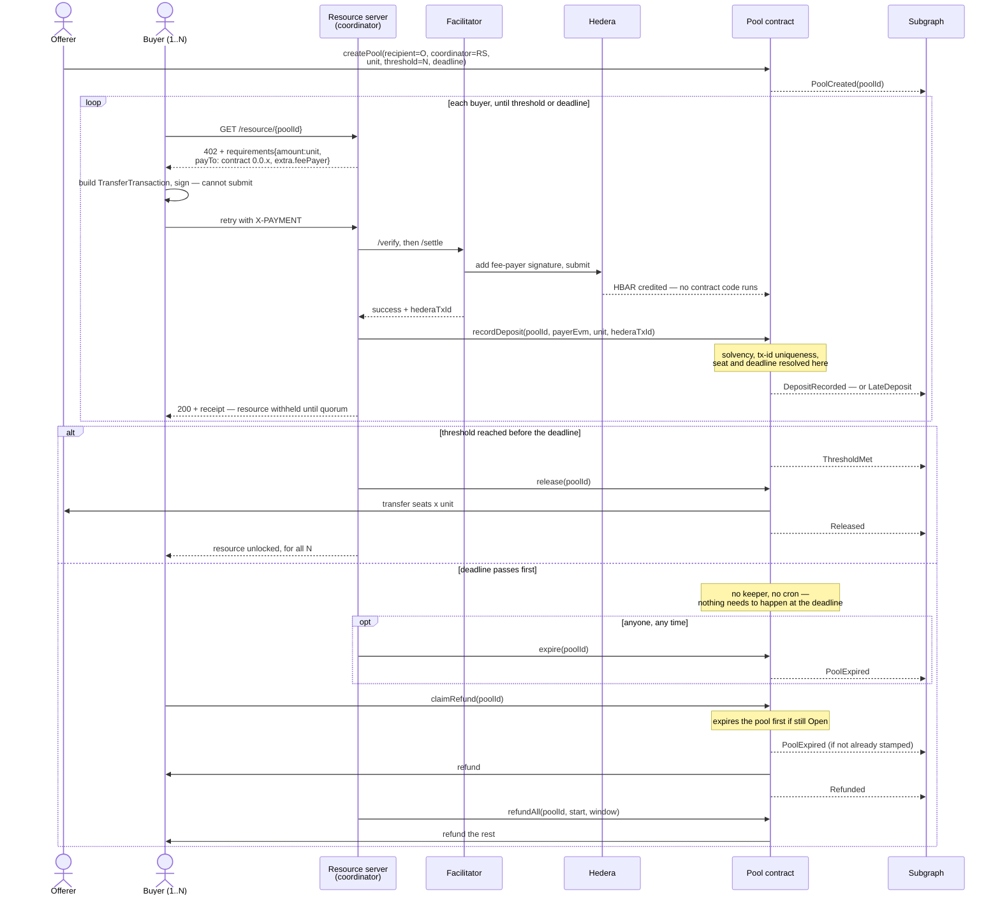

# The pool contract

The interface the reference implementation of `quorum` settles against, on Hedera, under the
`exact` binding.

**Written 2026-09-07, before the contract.** The decisions it implements are recorded in
[ADR 0001](adr/0001-what-quorum-binds-to.md) (why `exact`),
[ADR 0002](adr/0002-payment-attribution-on-hedera.md) (how a payment is attributed),
[ADR 0003](adr/0003-pool-authority-model.md) (who may do what) and
[ADR 0004](adr/0004-deposits-that-cannot-be-refused.md) (why nothing is rejected). This
document does not re-argue them; it says what the code must do.

---

## The shape, in one paragraph

One contract holds many pools. A pool is a threshold, a deadline, a unit price and a
recipient. Buyers pay the unit price over x402 to the contract's own Hedera account, and the
pool's coordinator records each settled payment. If enough **distinct** buyers pay before the
deadline, the funds go to the recipient. Otherwise every buyer gets their money back. Nobody
can do anything else with the funds, including the person who deployed the contract.

## Actors

| Actor | Calls the contract | Authority |
|---|---|---|
| **Offerer** | `createPool`; receives on release | None special — it is simply the named `recipient` |
| **Coordinator** (the resource server) | `recordDeposit` only | Per-pool. Cannot move funds, cannot change terms, cannot reach money already attributed to another payer or pool — but see below |
| **Buyer** | **Nothing on the happy path.** `claimRefund` only if the pool fails | Itself only |
| **Facilitator** | Never | Off-contract: adds the fee-payer signature and submits the transfer |
| **Deployer** | — | **Does not exist as a role.** No owner, no pause, no upgrade |

The buyer touching nothing is not an accident of convenience — it is what
[ADR 0002](adr/0002-payment-attribution-on-hedera.md) forces, and it is the demo's point: a
buyer signs one x402 payment and does nothing else.

**What a coordinator can still do, stated exactly.** It can name itself as the `payer` of a
deposit for a wrong amount, which is late on arrival and therefore refundable at once, and then
claim it. The solvency gate in `recordDeposit` bounds that to HBAR sitting in the contract that
no deposit has been attributed to yet, so it cannot touch another payer's money or another
pool's — but "cannot refund to itself" would be too strong a claim, and the code disproves it in
one call. This is the race
[ADR 0003](adr/0003-pool-authority-model.md#the-limitation-this-accepts-coordinators-can-race-for-unattributed-funds)
accepts and explains: one Hedera entity per pool closes it, at a cost the demo does not pay.

## Methods

```solidity
function createPool(
    address recipient,
    address coordinator,
    uint64  unitTinybars,
    uint32  threshold,
    uint64  deadline,
    string calldata resourceUrl
) external returns (uint256 poolId);

function recordDeposit(
    uint256 poolId,
    address payer,
    uint64  tinybars,
    string calldata hederaTxId
) external returns (uint256 depositId, bool counted);

function expire(uint256 poolId) external;
function release(uint256 poolId) external;
function claimRefund(uint256 poolId) external returns (uint256 tinybars);
function refundAll(uint256 poolId, uint256 startIndex, uint256 maxDeposits)
    external returns (uint256 refunded);
function withdraw() external returns (uint256 tinybars);
```

| Method | Caller | Gate | Effect |
|---|---|---|---|
| `createPool` | anyone | `threshold > 0`, `unitTinybars > 0`, `deadline > block.timestamp`, non-zero addresses, and `threshold * unitTinybars` fits `uint64` | Allocates `poolId`; terms are immutable thereafter |
| `recordDeposit` | **the pool's coordinator** | `msg.sender == pool.coordinator`, non-zero `payer`, `tinybars > 0` | Attributes one settled payment; marks `Met` and emits `ThresholdMet` when the seat count reaches the threshold. Never reverts for a buyer-side reason — [ADR 0004](adr/0004-deposits-that-cannot-be-refused.md). A payment of zero is not a buyer-side reason: nothing arrived, so nothing is stranded by refusing it |
| `expire` | anyone | pool is `Open` **and** the deadline has passed; idempotent once `Expired` | Stamps `Expired`, emits the event. **Optional** — the refund paths do it themselves |
| `release` | anyone | pool is `Met` | Pays `recipient` the counted total, marks `Released` |
| `claimRefund` | **the payer** | has a refundable deposit | Expires the pool if due, then sweeps every refundable deposit the caller holds |
| `refundAll` | anyone | scans the window `[startIndex, startIndex + maxDeposits)` | Expires the pool if due, then pushes refunds for every refundable deposit in the window |
| `withdraw` | anyone with credit | has credit | Escape hatch when a push transfer failed |

**Due** means `state == Open && block.timestamp >= deadline`, and it is the only condition
under which a pool becomes `Expired`. A pool that reached `Met` therefore never expires,
whatever the clock says: `expire` reverts on it, and the *expires the pool if due* in
`claimRefund` and `refundAll` does nothing. That is what stops a met pool's counted deposits
from becoming refundable after quorum was already reached.

Views: `statusOf`, `poolOf`, `poolCount`, `depositCount`, `depositAt`, `committedTinybars`,
`balanceTinybars`. Pool ids are allocated sequentially from zero, so `poolCount` is both the
next id and the bound on every existing one.

> `statusOf` reports the **effective** status: a pool that is still `Open` when its deadline
> passes reads as `Expired` before anyone has stamped it. Stored state and effective status
> differ exactly in that window, and every method that acts on state resolves it first.

### Why `release` and `expire` are permissionless

Neither chooses anything. `release` can only pay the recipient the pool named at creation, and
only once the threshold is met; `expire` can only record a fact the clock already settled.
Gating them would add a party who can stall the outcome without adding a party who can change
it.

### Why `refundAll` is not a convenience

A buyer who spent their HBAR paying may not be able to afford the gas to claim it back.
`claimRefund` is the trust-minimal path and `refundAll` is the one that actually runs at a
failed deadline.

It takes a **window**, `[startIndex, startIndex + maxDeposits)`, and `maxDeposits` bounds the
deposits *examined* rather than the refunds *made* — because examining is what costs gas, and a
bound on refunds leaves the scan itself unbounded. Drive it by advancing `startIndex` a window
at a time until `startIndex >= depositCount`. **Not** by calling until it returns zero: an
exhausted window returns zero while money is still owed further down the list.

`startIndex` is a caller's hint, not state the contract keeps, and the distinction is the whole
of the design. A stored cursor would be **wrong**, not merely inelegant: refundability is not
monotonic in index — a late deposit is refundable the moment it is recorded, a counted one only
once the pool expires — so an index the scan has already passed can hold money that is only now
owed, and a cursor could never return for it. Skipping already-refunded deposits instead makes
every window safe to re-scan, in any order, by anyone.

The window buys one thing a scan fixed at zero could not. Payouts forward all remaining gas (a
2300-gas stipend would break any payer that is itself a contract), so a payer whose `receive()`
burns gas takes 63/64 of the frame; sitting at a low index, it would starve every call that had
to begin at zero, and the refund path that exists precisely for buyers who cannot pay gas would
be the one a griefer could close. A caller can now step over it. That payer's own deposit stays
stuck, which is the right place for the cost to land.

## State

```
                       recordDeposit (seats == threshold)          release
    Open ────────────────────────────────────────────► Met ─────────────────► Released
      │
      │ deadline passed — stamped by expire(), claimRefund() or refundAll()
      ▼
   Expired  ──►  counted deposits become refundable
```

- `Met` is unreachable after the deadline: `recordDeposit` takes a seat only while
  `block.timestamp < deadline`
- `Expired` is unreachable after `Met`, for the same reason
- **Late deposits are refundable in every state**, including `Met` and `Released`

## Storage

```solidity
enum State { Open, Met, Expired, Released }

struct Pool {
    address recipient;
    address coordinator;
    uint64  unitTinybars;
    uint32  threshold;
    uint32  seats;          // counted deposits so far
    uint64  deadline;       // unix seconds
    State   state;
    string  resourceUrl;
}

struct Deposit {
    address payer;          // EVM address, so claimRefund has a msg.sender to match
    uint64  tinybars;
    bool    counted;        // false => late: no seat, refundable at once
    bool    refunded;
}
```

Amounts are `uint64`. Total HBAR supply is 5x10^18 tinybars against a `uint64` ceiling of
1.8x10^19, so no real amount can overflow one — and a `Deposit` then fits in a **single storage
slot**: 20 bytes of address, 8 of amount, 2 of flags. `totalCommitted` stays `uint256`, because
it occupies a whole slot either way and the wider type removes any need to reason about a sum
overflowing at all.

Plus, at contract level:

| | |
|---|---|
| `mapping(uint256 => Deposit[])` | deposits per pool — a list, because a payer may hold several late deposits |
| `mapping(uint256 => mapping(address => bool)) seatTaken` | one seat per payer |
| `mapping(bytes32 => bool) txIdSeen` | `keccak256(hederaTxId)`, **global**, so one payment cannot be recorded into two pools |
| `uint256 totalCommitted` | tinybars the contract owes to a payer or a recipient |
| `mapping(address => uint256) credit` | owed to someone whose push transfer failed |

`hederaTxId` is deliberately **not** in the struct. No contract logic reads it: the uniqueness
guard hashes it straight from calldata, nothing compares it, nothing returns it. Its only
consumers are humans and indexers, so it is emitted in `DepositRecorded` and lives there.
Logs are part of consensus, cannot be deleted, and are exactly what the subgraph reads — while
a 33-character Hedera transaction id is a long string, costing three storage slots to keep and
nothing to emit.

> This refines [ADR 0002](adr/0002-payment-attribution-on-hedera.md), which says the contract
> "stores that id". The guarantee it argues for is unchanged — every recorded deposit still
> names a real Hedera transaction that any third party can verify against a mirror node — but
> the contract commits to it in a log rather than in state.

### What belongs in storage

> The contract stores what it must **enforce**. History lives in the events and the subgraph.

Every field above is read by contract logic: `seatTaken` enforces one seat per payer,
`txIdSeen` refuses a replayed payment, `totalCommitted` backs the solvency invariant, and a
`Deposit` decides who may be refunded what. Nothing is kept because it might be interesting
later — a completed pool's participant list is read from the index, not from state.

**`txIdSeen` is permanent, whatever else is ever cleared.** It is the anti-replay guard, and if
its entry were removed alongside the deposit it guards, a coordinator could record the same
payment a second time. It has to outlive the thing it protects. This is the one place where
"delete everything about a settled deposit" is the wrong instinct.

**Reclaiming a settled deposit's slot was considered and declined.** A refunded or released
deposit stops mattering to the contract, and a `sweep(poolId, maxDeposits)` could clear it. It
is not built:

- it cannot ride along on `release`, because clearing N entries in one transaction is the same
  unbounded-loop hazard `refundAll` exists to dodge — so it is a new method, with new tests,
  touching the refund path, which is the riskiest code here
- the saving is one slot per buyer, now that a `Deposit` is one slot
- the gas refund for clearing storage has been small since EIP-3529, and whether Hedera's HSCS
  honours it at all is unverified here

**Deletion would not be a state, either.** `Released` and `Expired` stay distinct terminal
states. Collapsing them into one would leave `statusOf` unable to say whether a pool succeeded,
which is the single fact a reader most wants from it.

## The solvency invariant

```
totalCommitted  <=  address(this).balance / TINYBAR_TO_WEIBAR
```

Checked before every attribution. `totalCommitted` rises in `recordDeposit` and falls **only
when HBAR actually leaves the contract** — a failed push moves the amount into `credit` and
leaves `totalCommitted` untouched, because the money is still owed.

| Method | `totalCommitted` |
|---|---|
| `recordDeposit` | `+ tinybars`, after checking the invariant still holds |
| `release` | `− seats × unitTinybars`, on a successful transfer |
| `claimRefund` / `refundAll` | `− deposit.tinybars` per successful transfer |
| `withdraw` | `− amount`, on a successful transfer |

Consequences worth stating in the README: a threshold cannot be crossed without real HBAR
having arrived, and no pool can be paid out of another pool's funds. The residual —
`balance − totalCommitted`, money that arrived and was never attributed — is unrecoverable by
anyone, which is [ADR 0003](adr/0003-pool-authority-model.md)'s deliberate cost of having no
owner.

## Events

Every state transition emits, so a subgraph reconstructs full pool state with no RPC reads.

```solidity
event PoolCreated(uint256 indexed poolId, address indexed coordinator, address indexed recipient,
                  uint64 unitTinybars, uint32 threshold, uint64 deadline, string resourceUrl);
event DepositRecorded(uint256 indexed poolId, address indexed payer, uint256 depositId,
                      uint64 tinybars, string hederaTxId, uint32 seatsAfter);
event LateDeposit(uint256 indexed poolId, address indexed payer, uint256 depositId,
                  uint64 tinybars, string hederaTxId, LateReason reason);
event ThresholdMet(uint256 indexed poolId, uint32 seats, uint64 at);
event PoolExpired(uint256 indexed poolId, uint64 at);
event Released(uint256 indexed poolId, address indexed recipient, uint64 tinybars);
event Refunded(uint256 indexed poolId, address indexed payer, uint256 depositId, uint64 tinybars);
event PayoutFailed(uint256 indexed poolId, address indexed to, uint64 tinybars);
event Withdrawn(address indexed to, uint64 tinybars);

enum LateReason { ThresholdMet, DeadlinePassed, SeatTaken, WrongAmount }
```

Two notes for the subgraph mappings:

- **`PoolExpired` usually arrives in the same transaction as the first `Refunded`**, ordered
  before it. A mapping that assumes expiry has a transaction of its own will mis-order state
- `LateDeposit` is the interesting entity, not a footnote. *A payment arrived and did not make
  it* is the event a pool page has to show, and `LateReason` says why
- **These two events are the only record of a payment's Hedera transaction id** — it is not in
  contract state. An index is therefore not an optimisation here; it is how the history is read
  at all

## The flow



`release`, `expire` and `refundAll` are drawn as the resource server's calls only because it is
the party watching. All three are permissionless.

## Hedera specifics the implementation must get right

| | |
|---|---|
| **Weibars are not tinybars** | Hedera's EVM denominates HBAR in weibars, at `1 tinybar = 1e10 weibar`, so `address(this).balance` and `call{value:}` are **not** in the units x402 quotes. Keep the entire ledger in tinybars — matching `PaymentRequirements.amount` — and convert at exactly two places: the solvency check and the payout. One named constant, `TINYBAR_TO_WEIBAR` |
| **Use `call`, not `transfer`** | The 2300-gas stipend is not a safe assumption here |
| **Never derive accounting from `balance`** | It includes unattributed funds. `balance` appears only as the ceiling in the invariant |
| **The recipient may be a long-zero address** | A Hedera account with an ED25519 key has no EVM alias; `0x00…0<num>` is its address and a valid value target |
| **`payTo` is the contract's Hedera id** | `0.0.x` form, as `PaymentRequirements.payTo` in [`src/x402/types.ts`](../src/x402/types.ts) expects |
| **No receiver signature** | Required by [ADR 0002](adr/0002-payment-attribution-on-hedera.md) — the transfer must land without the contract signing |
| **`receive() payable`** | Not needed for the x402 path, since a native transfer runs no code. Include it anyway so an EVM-side top-up is not silently rejected |

## What must be verified before the Solidity is written

Minutes each, and the first one can invalidate the design.

1. ✅ **Will the facilitator accept a `payTo` that is a contract, not an account?**
   **Verified on testnet 2026-09-07.** `/verify` accepted it, `/settle` moved 0.1 HBAR into
   contract `0.0.10407447` (`0.0.7162784@1788790885.988213434`), and the mirror node shows the
   balance change. [ADR 0002](adr/0002-payment-attribution-on-hedera.md)'s Option A holds.
   Re-runnable: [`scripts/check-contract-payto.ts`](../scripts/check-contract-payto.ts).
2. ✅ **Does a native `CryptoTransfer` credit a contract account, with no receiver signature
   and no code executed?** **Verified in the same settlement.** The mirror node records it as
   `CRYPTOTRANSFER`/`SUCCESS`, and `/api/v1/contracts/results/<txId>` returns 404 — there is
   no contract result, because no contract code ran. This is what
   [ADR 0004](adr/0004-deposits-that-cannot-be-refused.md) rests on: there was no moment at
   which the payment could have been rejected.
3. ⬜ **Confirm the weibar conversion empirically with one throwaway payout.** *Still open, and
   the refund arithmetic depends on it — but on a narrower question than this item first
   claimed.* The tests define their own `TINYBAR_TO_WEIBAR` in `test/helpers.ts`, independent of
   the contract's, and assertions that compare a contract-reported tinybar figure against a
   test-computed weibar one do pin the two together. So the suite *does* catch a wrong constant
   in the contract. What it cannot catch is both being wrong the same way — that `1 tinybar =
   1e10 weibar` is Hedera's real ratio and not merely ours. That is documented rather than
   guessed (1 HBAR = 1e8 tinybar = 1e18 weibar), and one real payout from a deployed contract
   converts it from documented to observed.
4. ⬜ **Does subgraph indexing reach Hedera testnet contracts, and through whose graph-node?**
   Still open. The Graph integration rests on it.
