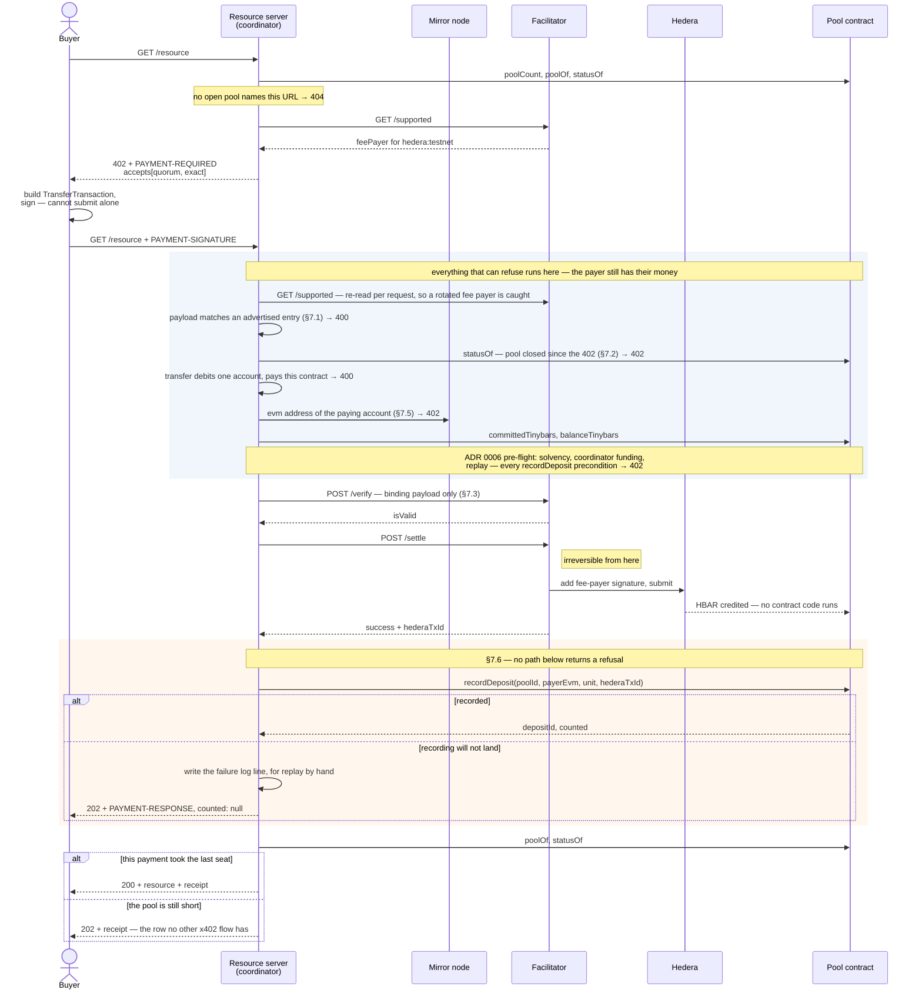
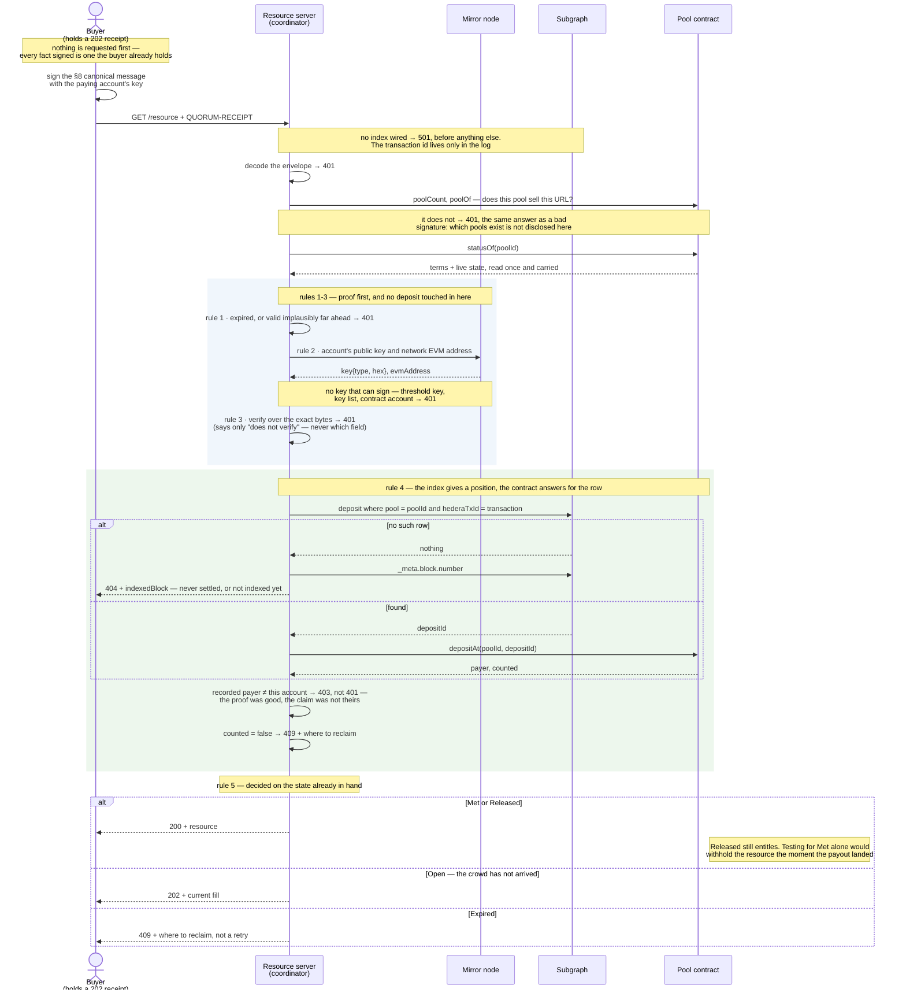

# The `quorum` scheme

> **Status:** proposed here, not upstream. Written 2026-09-08, before the code it specifies. What
> is built is stated per hold binding in §10, and claimed nowhere else.
>
> Sources for every quotation of the x402 specification are listed in §13, with the date they
> were read.

`quorum` is an x402 payment scheme for a resource that **many separate payers buy together**. A
pool has a unit price, a threshold and a deadline. Each payer commits the unit price. If enough
distinct payers commit before the deadline, the resource unlocks for all of them and the funds go
to the seller. If they do not, every payer gets their money back.

The coordination is the scheme. **How any individual payer's funds are held between commitment
and outcome is deliberately not part of it** — that is delegated to a *hold binding*, named in the
requirement and nested in the payload. This document specifies the coordination, defines the
binding interface, and specifies one binding in full: `exact` on Hedera, over a pool contract.

---

## 1. What x402 does not express as of 2026-09-08

As of 2026-09-08 the specification defines four schemes — `exact`, `upto`, `batch-settlement` and
`auth-capture` — and each describes **one payer settling one request**.

`auth-capture` is the closest, and the one worth being precise about, because the naive claim
("x402 cannot hold funds and refund them on a deadline") is false: `auth-capture` places a hold
before the resource runs and bounds it with a capture deadline, after which the client may
reclaim. What it cannot express is a release condition that lives **outside the payer and the
server**:

| | `auth-capture` | `quorum` |
|---|---|---|
| Payers | One | N distinct |
| Release decided by | The server's discretion | Whether other payers showed up |
| Deadline protects | The payer, against a server that never captures | The payer, against a crowd that never forms |
| Failure outcome | Void or reclaim | Every payer refunded |

The gap is **coordination across payers**: one payer's outcome conditional on others, where no
participant — including the seller — can force the result. That is what `quorum` adds.

## 2. The `conditional` payment flow

§6.1 of the specification classifies schemes by **when settlement occurs relative to resource
execution**, and defines three flows. `quorum` needs a fourth, and this document proposes it
separately from the scheme, because it is not quorum-specific.

| Flow | Ordering | Note |
|---|---|---|
| `authorization` | verify → resource → settle → respond | Existing |
| `upfront` | settle → resource → respond | Existing |
| `escrow` | settle → resource → settle → respond | Existing |
| **`conditional`** | **verify → settle → hold → *resource \| reverse*** | **Proposed here** |

Under `conditional`, funds are durably committed before the resource executes, and **the resource
may never execute at all**. If the condition the scheme defines is not met by its deadline, the
commitment is reversed by a path the scheme specifies. The condition is scheme-defined;
`conditional` says only that one exists, and that failing it returns the money.

`/verify` is part of this ordering, unlike `upfront`. The reason is precise: **before `/settle`,
refusing a payer costs them nothing; after it, the money has moved and cannot be un-moved by
refusing.** A flow that promises reversal should spend its cheap refusal before its expensive one.

`conditional` also answers a gap the specification names in `upfront` and leaves open:

> Under `upfront` the payment commits first, so a handler failure leaves the client charged with
> nothing delivered; this specification defines no refund, and any remedy is the resource server's
> own arrangement.

A `conditional` scheme MUST define that remedy. §9 defines `quorum`'s.

`extra.paymentFlow` is a protocol-reserved key, so a new value is a specification-level proposal
and is made as one — see [ADR 0005](adr/0005-what-quorum-declares-on-the-wire.md).

## 3. `PaymentRequirements` for `quorum`

```jsonc
{
  "scheme": "quorum",
  "network": "hedera:testnet",
  "amount": "100000000",
  "asset": "0.0.0",
  "payTo": "0.0.10409980",
  "maxTimeoutSeconds": 120,
  "extra": {
    "paymentFlow": "conditional",
    "poolId": "7",
    "threshold": 3,
    "filled": 1,
    "deadline": 1789171200,
    "binding": { "scheme": "exact", "extra": { "feePayer": "0.0.7162784" } }
  }
}
```

| Field | Meaning |
|---|---|
| `amount` | **One seat**, not the pool total. What this payer pays |
| `payTo` | Where the hold lives. Under the `exact` binding, the pool contract's own account |
| `extra.poolId` | Identifies the pool. A **string**: it is a `uint256` on-chain and is not safely a JSON number |
| `extra.threshold` | Distinct counted payers required |
| `extra.filled` | Seats counted **at the time this response was written**. Advisory |
| `extra.deadline` | Unix seconds. After it, no payment can be counted |
| `extra.paymentFlow` | `"conditional"`. MUST be present — §5 |
| `extra.binding` | The hold binding: `{ scheme, extra }`, naming how one payer's funds are held and carrying whatever that binding's own requirement needs. §10 |

`amount`, `asset`, `payTo` and `network` describe the payment itself, so they are stated once at
the `quorum` level rather than repeated inside `extra.binding`; a binding inherits them. They sit
at the top level because clients select entries on them. Where a fallback entry is offered, it
MUST carry the same four (§5).

**`filled` is advisory and MUST be treated as stale.** It is true when written and may be wrong by
the time the payer signs. A client MUST NOT read `filled < threshold` as a guaranteed seat; a
payment arriving after the last seat is taken is handled by §6, not prevented by this field. The
authority on seat count is the hold binding's own state.

## 4. `PaymentPayload` for `quorum`

```jsonc
{
  "x402Version": 2,
  // ResourceDescriptor — url, description and mimeType are all required
  "resource": { "url": "https://example.test/resource/7", "description": "…", "mimeType": "…" },
  // the §3 entry echoed back, minus the advisory `filled`, which a client MAY omit
  "accepted": {
    "scheme": "quorum",
    "network": "hedera:testnet",
    "amount": "100000000",
    "asset": "0.0.0",
    "payTo": "0.0.10409980",
    "maxTimeoutSeconds": 120,
    "extra": {
      "paymentFlow": "conditional",
      "poolId": "7",
      "threshold": 3,
      "deadline": 1789171200,
      "binding": { "scheme": "exact", "extra": { "feePayer": "0.0.7162784" } }
    }
  },
  "payload": {
    "poolId": "7",
    "binding": { "transaction": "<base64 partially signed TransferTransaction>" }
  }
}
```

`accepted` is the client's echo of the requirement it chose; `payload` is the scheme-specific
data. **The echo is the client's statement, not evidence.** A server MUST validate it against what
it actually advertised, MUST reject a payment whose `payload.poolId` disagrees with
`accepted.extra.poolId`, and MUST ignore advisory fields in it — `filled` is stale by construction
(§3), and a client's copy of it says nothing at all.

`payload.binding` is **the hold binding's own payload, verbatim** — for the `exact` binding on
Hedera, exactly the object that binding defines. A resource server unwraps it and passes it to the
facilitator unchanged. Nothing in the `quorum` layer rewrites, re-signs or re-encodes it.

This is the structural claim of the scheme, expressed in the format: swap the binding, and only
the inner object changes.

**The payload does not name the payer, and a client cannot make it do so.** See §7.

## 5. The `exact` fallback entry

A `PaymentRequired` for a quorum-gated resource SHOULD carry a second `accepts[]` entry describing
the **same payment** under its hold binding's own scheme:

```jsonc
// identical to the §3 entry except `scheme` and `extra`
{
  "scheme": "exact",
  "network": "hedera:testnet",
  "amount": "100000000",
  "asset": "0.0.0",
  "payTo": "0.0.10409980",
  "maxTimeoutSeconds": 120,
  "extra": { "paymentFlow": "upfront", "feePayer": "0.0.7162784" }
}
```

Its purpose is interoperability with clients that do not implement `quorum`. Why a fallback rather
than an extension or a bare scheme is [ADR 0005](adr/0005-what-quorum-declares-on-the-wire.md).

- The fallback entry MUST declare the same `payTo`, `amount`, `asset` and `network` as the
  `quorum` entry. It is the same payment, described under the hold binding's own scheme.
- A server MUST declare `extra.paymentFlow` on **both** entries. The Hedera `exact` binding
  declares neither an `assetTransferMethod` nor a default flow, so a client has nothing to resolve
  against, and the specification requires the field once the resolved flow is not `authorization`.
- A client that does not recognise `paymentFlow: "conditional"` MUST NOT construct a payment for
  the `quorum` entry, and SHOULD skip it.

Two consequences follow, and the second is a weakness this document does not hide.

- A payer arriving through the fallback is recorded and holds a seat exactly as a `quorum` payer
  does. It receives a receipt rather than the resource (§6), is refunded automatically if the pool
  fails (§9), and can redeem whenever the pool succeeds (§8), because entitlement is derived from
  chain state and not from having understood the scheme.
- **`upfront` is accurate about timing and cannot express conditionality** — and an entry has
  nowhere to say more, because `PaymentRequirements` has no human-readable field. The warning has
  to be carried at the response level instead, in `resource.description` and in `error`, which
  belong to the whole `PaymentRequired` rather than to the entry a legacy client selects. So a
  client reading protocol fields learns that its funds commit before the resource runs, and does
  not learn that the resource may never run. This is the residual silence the fallback trades for
  reach; a server unwilling to make that trade may omit the entry.

## 6. Lifecycle

The HTTP transport maps x402 outcomes onto status codes, and its table has **no code for a payment
that settled while the resource stays pending**, because every existing flow either delivers or
fails. `conditional` adds one row: **202 Accepted**.

| Request | Condition | Status |
|---|---|---|
| `GET` resource | No open pool names this URL | 404 |
| `GET` resource | An open pool does | 402 + `PAYMENT-REQUIRED` |
| `+ PAYMENT-SIGNATURE` | Payload malformed, or does not match the advertised terms | 400 |
| " | Pool closed between the 402 and the payment — caught **before** `/settle` | 402 |
| " | `/verify` or `/settle` rejects | 402 + `PAYMENT-RESPONSE` |
| " | Settled; threshold not yet met | **202** + `PAYMENT-RESPONSE` + receipt |
| " | Settled; **this payment** met the threshold | 200 + resource + `PAYMENT-RESPONSE` |
| `+ QUORUM-RECEIPT` | Threshold reached, proof valid, deposit **counted** | 200 + resource |
| " | Proof valid, but the deposit took no seat (`counted: false`) | 409 + where to reclaim |
| " | Pool still open | 202 + current fill |
| " | Pool expired | 409 + where to reclaim |
| " | Proof valid, but the deposit belongs to another account | 403 |
| " | No deposit in this pool for that transaction | 404 |
| " | Proof invalid or expired | 401 |

Redemption is not a payment handshake, so the last six are ordinary HTTP rather than x402 error
mappings.

**403 and 404 are distinguished from 401 deliberately.** All three refuse, and a payer can act on
only one of them. 401 says the proof did not stand up, so signing again with the right key, pool
or expiry may work. **403** says the signature was good and the deposit is somebody else's: there
is no better credential to present, and inviting a retry would be a lie. **404** says this pool
has no deposit under that transaction id, which is not a statement about the proof at all - and
whose ordinary cause is an index a second behind the settlement that just funded the seat, so a
server SHOULD report how far the index has got and a client SHOULD retry rather than conclude its
payment never happened.

**Delivery depends on the threshold being met, never on the seller having been paid.** Paying the
seller is a separate, permissionless action; coupling a buyer's access to it would let a failed
payout withhold a resource the crowd has already earned.

### 6.1 The receipt

Response bodies are a server concern under the HTTP transport, so the receipt is a body, and the
protocol facts stay in `PAYMENT-RESPONSE`.

```jsonc
{
  "poolId": "7",
  "payer": "0x857b...",
  "transaction": "0.0.1235@1700000000.000000000",
  "attributed": true,
  "counted": true,
  "seat": 2,
  "threshold": 3,
  "deadline": 1789171200,
  "pool": { "state": "open", "filled": 2 },
  "next": [
    { "action": "redeem",  "when": "threshold met",   "header": "QUORUM-RECEIPT" },
    { "action": "reclaim", "when": "deadline passes", "contract": "0.0.10409980",
      "method": "claimRefund(uint256)" }
  ]
}
```

`attributed` and `counted` are separate facts and MUST NOT be conflated. A payment can be recorded
against the pool without taking a seat — it arrived after the last one, or after the deadline — in
which case it is refundable immediately and `counted` is `false`. Reporting such a payment as a
seat would be a lie the payer discovers only when redemption fails.

### 6.2 The payment leg, as built

One buyer taking one seat. The refusals are drawn where they actually happen, because *where* is
the whole design: every one of them is on the left of the `/settle` line.



A payment that settles and takes no seat — it arrived after the last one, or after the deadline —
still ends at 202, with `counted: false` and a receipt that is refundable at once rather than
redeemable. §6.1 forbids reporting that as a seat.

## 7. Resource server verification rules (MUST)

1. **Match the payload to an advertised entry.** A `quorum` payload whose `poolId` does not name
   the pool this resource advertised MUST be rejected with 400, before any facilitator call.
2. **Refuse closed pools before settling.** If the pool is no longer open, or its deadline has
   passed, the server MUST reject with 402 and MUST NOT call `/settle`.
3. **Unwrap before calling the facilitator.** A facilitator serves the *binding's* scheme, not
   `quorum`, and will reject an envelope naming one it does not implement. The server MUST
   construct a binding-level request — `{ x402Version, resource, accepted: `**the binding's own
   requirement**`, payload: `**`payload.binding` verbatim**` }` — and pass that to `/verify` and
   `/settle`, with the matching binding-level `PaymentRequirements`. The binding payload itself is
   never rewritten, re-signed or re-encoded; only the envelope around it is built.
4. **Require exactly one debited account.** The server MUST reject a binding payload whose
   transfer debits more than one account, and MUST check that the credit leg pays `amount` to
   `payTo`. A transfer can net to zero while debiting two parties, which would leave both the seat
   and the refund destination ambiguous.
5. **Derive the payer from the payment, not from the client and not from the settlement
   response.** The paying account is the debited party in the binding payload's own transfer,
   which the payer signed and the facilitator validates.

   On Hedera this rule has teeth, because the obvious field is the wrong one. The binding
   documents `SettlementResponse.payer` as:

   > `payer`: The Hedera account ID of **the fee payer** that sponsored the transaction.

   That is the facilitator. A server that attributes deposits from it records **every deposit in
   every pool against the facilitator**, which succeeds silently and makes every refund
   unreachable.
6. **Record what settled, even when recording fails.** Once `/settle` reports success, the funds
   have moved, and the server MUST NOT fail the request. It responds per §6, carrying
   `PAYMENT-RESPONSE` and a receipt with the transaction id; where the deposit could not be
   written it responds **202** with `attributed: false`, and MUST retry writing it. It MUST NOT
   answer with a bare 500: that destroys the payer's only evidence of a payment that really
   happened. A `settlement_pending` is treated identically: the specification makes it a
   **non-terminal** `SettleResponse.errorReason` and requires it to carry a non-empty
   `transaction`, so the payer still has a hash to reconcile against the chain.
7. **Never count a payment twice.** Deduplication is on the settled transaction id, and MUST be
   enforced by the hold binding's own state rather than by server memory.

## 8. Entitlement and redemption

Entitlement is **derived from the hold binding's state**, not from a session. A server holds
nothing that its restart could lose, and a third party can check any claim independently.

To redeem, a payer presents `QUORUM-RECEIPT`: the base64 encoding of the JSON object
`{ accountId, poolId, transaction, validUntil, signature }`, where `signature` is
base64-encoded raw signature bytes. The payer signs this canonical message with the key that
controls the paying account:

```
quorum402:redeem:v1\n
network hedera:testnet\n
contract 0.0.10409980\n
poolId 7\n
transaction 0.0.1235@1700000000.000000000\n
resource https://example.test/resource/7\n
validUntil 1789171500\n
```

**The message is signed as exact bytes, so its layout is normative**: UTF-8, one `key value` pair
per line, a **single space** between key and value, `\n` after every line including the last, keys
in the order shown, and no padding or alignment. The `\n` above are shown literally for that
reason; alignment would be ambiguous where a verifier must reproduce the bytes.

The server MUST, in order:

1. Reject an expired `validUntil`, or one implausibly far ahead.
2. Resolve the account's **public key and network EVM address** from the ledger.
3. Verify the signature against that key, whatever its type.
4. Find the deposit whose settled transaction id matches, in that pool, and require both that its
   recorded payer equals that EVM address and that it is `counted`.

   The transaction id is **not** contract state under the `exact` binding — it is emitted with
   `DepositRecorded` and `LateDeposit` rather than stored, so the id resolves to a deposit index
   through the binding's logs (an indexer or the mirror node), and the payer and `counted` facts
   are then read back from the contract at that index. Logs are consensus state, so this is still
   derived from the binding rather than from the server; it is not a view call.
5. Serve the resource only if the pool has **reached its threshold** — `seats >= threshold`,
   equivalently a state of `Met` **or `Released`**. A pool that has already paid the seller out
   still entitles every counted payer: testing for `Met` alone would withhold the resource the
   moment the payout landed, which is the coupling §6 forbids.

**The recorded payer address MUST be the address the network holds for the account**, at recording
time and at redemption time alike. Deriving it from the account's key at one end and reading it
from the ledger at the other produces addresses that differ for some account types, and the
mismatch surfaces only as a seat that cannot be redeemed.

The message binds protocol, network, contract, pool, transaction, resource and expiry, so a
signature cannot be replayed against another pool, server or network. **Within its validity window
it can be replayed by anyone who observes it** — the window and the transport are what contain
that, and what it yields is a resource already unlocked for N payers. It is a proof of
entitlement, not a bearer secret, and this document does not claim otherwise.

Because the window *is* the containment, rule 1's "implausibly far ahead" needs a number in any
implementation. The reference implementation refuses anything more than **15 minutes** ahead and
allows 30 seconds of clock skew on expiry, in the payer's favour only — a receipt refused slightly
late costs one retry, one refused slightly early costs a seat that will not open. A payer has no
reason to sign a longer-lived receipt than the request it is about to make, and this one asks for
two minutes.

### 8.1 Redemption, as built

The ordered checks above, drawn against what runs. Two things the prose can only assert and a
diagram shows: **the deposit is never looked up until the signature verifies, and the ledger is
never asked until the receipt is in date** — which is what stops an unsigned request learning
whether a transaction or a seat exists — and the deposit is resolved in **two hops**, an index for
the position and the contract for the facts, so no indexer can make a seat valid.

The pool itself *is* read before any of that, because the server has to know whose terms the
receipt is being checked against. That read discloses nothing a 402 on the same URL would not.



Nothing is written down on any path. The server holds no record that a seat was redeemed, so a
restart, a second coordinator, or a third party with the same reads reaches the same answer —
which is what "entitlement is derived from the hold binding's state" means in practice.

## 9. Reversal

If the deadline passes without the threshold being met, every payer is owed their money.
`quorum`'s reversal path is **not an HTTP endpoint, deliberately**:

- Any payer can reclaim their own funds directly from the hold, without the server.
- Anyone at all can push refunds to every payer in a failed pool — including the seller, a
  bystander, or a payer who cannot afford the gas to claim.
- A push that the payer's account rejects leaves the amount as credit they can pull later, so a
  failed transfer strands nothing. Under the `exact` binding these are `claimRefund`, `refundAll`
  and `withdraw` — [pool-contract.md](pool-contract.md).

Putting reversal behind the resource server would make the refund depend on the liveness of the
party whose failure the payer most needs protection from. A `conditional` flow whose reversal
requires a cooperative server has not defined a remedy; it has named one.

## 10. Hold bindings

A hold binding answers one question: how is one payer's money held between commitment and outcome?
`quorum` names three and builds one; why three, and why these three, is
[ADR 0001](adr/0001-what-quorum-binds-to.md).

| Binding | Status here | Status upstream |
|---|---|---|
| `exact` + pool contract | **Built and demonstrated on testnet**, including the coordinator implementing §6–§8 | Merged; 17 network bindings |
| `auth-capture` | Not built | Merged; **EVM only** |
| `escrow` | Not built | **Proposed, open** |

### 10.1 `exact` over a pool contract — built

The payer makes an ordinary `exact` payment whose `payTo` is a contract that holds many pools. The
hold is the contract; the scheme's threshold, deadline and reversal are enforced there. The
contract, its authority model and its solvency invariant are specified in
[pool-contract.md](pool-contract.md), and the reason attribution needs a deliberate mechanism on
Hedera is [ADR 0002](adr/0002-payment-attribution-on-hedera.md).

Deployed for this project on Hedera testnet; the address and its verification are recorded in
[deployments/hedera-testnet.json](../deployments/hedera-testnet.json), which is the source of
truth. Account ids in this document's examples are illustrative — a client resolves `payTo` from
the requirement it was served, and `extra.feePayer` from the facilitator's `/supported`.

### 10.2 `auth-capture` — not built

`quorum` would place no pool contract at all. Each payer's funds would sit in a standard
`auth-capture` hold with its own capture deadline, and the coordinator would capture all of them
when the threshold is met, or void all of them when the deadline passes. The per-payer hold, the
deadline and the payer's unilateral reclaim already exist in that scheme, so `quorum` would
contribute only the counting and the all-or-nothing decision.

What is unproven: `auth-capture` has an EVM binding and no Hedera one, so this composition cannot
be demonstrated on the network this project settles on, and no facilitator available to it serves
the scheme. Whether capturing N holds can be made atomic — or whether `quorum` must tolerate a
partial capture and define recovery — is exactly the question building it would answer, and this
document does not pretend to have answered it.

### 10.3 `escrow` — not built

`escrow` ([x402-foundation/x402#2222](https://github.com/x402-foundation/x402/issues/2222)) takes
the opposite architectural position to `auth-capture`: standardise the wire format and leave the
escrow contract implementation-defined, so that no single implementation is privileged. `quorum`
would bind to it much as it binds to `auth-capture`, with the hold contract-mediated but
unspecified.

> **Disclosure.** `escrow` (x402-foundation/x402#2222) is a proposal authored by this project's
> author on behalf of Boson Protocol, and remains open. The x402B facilitator that serves it on
> Base is Boson Protocol's as well — so a facilitator existing for `escrow` is not independent
> ecosystem uptake, and is not offered here as evidence that the proposal is settled. It is cited
> as one of two candidate hold bindings, not as settled standard, and its `nextActions` shape
> informs the receipt in §6.1. Its content is referenced; no text or code from the associated
> repositories is reused in this project.

Its `nextActions` envelope — a server telling a client what to do next without the client
hard-coding state transitions — is close in shape to what a quorum coordinator must express, and
the receipt's `next` array in §6.1 is built on that idea.

What is unproven: the proposal is not merged, so the wire format it standardises can still move,
and the facilitator that serves it — Boson Protocol's x402B — settles on Base, not the network
this project settles on. Composing over it would mean specifying against an unmerged format *and*
demonstrating on a second network. That is the same feasibility wall as `auth-capture`, reached
from the other side, and it is not a judgement on the design.

### 10.4 Why exactly three

The two unbuilt bindings take opposite positions on where the hold belongs, so binding cleanly to
both is what shows `quorum` is orthogonal to that axis rather than dependent on either answer. The
reasoning, and the evidence behind it, is [ADR 0001](adr/0001-what-quorum-binds-to.md).

## 11. Limitations

- **Attribution depends on the coordinator's liveness under the `exact` binding**, and an
  unrecorded deposit is stranded rather than stolen ([ADR 0002](adr/0002-payment-attribution-on-hedera.md),
  [ADR 0003](adr/0003-pool-authority-model.md), §12). The trust is for liveness, never integrity: a
  recorded deposit always names a real settled transaction, so deposits can be omitted but never
  invented, and a threshold cannot be crossed without real money behind it. Recording late still
  works and still refunds, so only permanent coordinator failure is permanent.
- **`filled` is stale by construction**, and a payer can pay for a seat that has just been taken.
  That payment is recorded, not counted, and refundable at once — correct, but it costs the payer a
  transaction fee and a round trip.
- **A redemption proof is replayable inside its validity window** (§8).
- **A fallback payer is told about conditionality only in prose, and only at the response
  level**, because an `accepts[]` entry has no field to carry it (§5).
- **This scheme is proposed, not adopted.** No facilitator serves `quorum`, and none needs to: the
  facilitator only ever sees the binding's payment. But `paymentFlow: "conditional"` is a value no
  deployed client recognises, which is what makes the fallback entry load-bearing rather than
  decorative.

## 12. Open questions

**1. A signed settlement receipt — the one that matters.** `SettlementResponse` carries `success`,
`transaction`, `network` and `payer`, and **no signature**, while the client does receive it. So a
payer already holds a statement that their payment settled, and no contract can act on it, because
nothing authenticates it. If a facilitator signed `(payer, asset, amount, payTo, transactionId)`
with a published key, a payer could present that to the hold directly and **the coordinator would
leave the refund path entirely** — the first limitation above would be gone, not mitigated.

This is a question for x402 rather than for this project, and it is one `conditional` raises by
existing: **a flow that promises reversal owes the payer a way to prove the commitment without the
cooperation of the party who might have failed them.**

**2. Intent before payment.** A payer could register an intent to join before paying, so the hold
knows whom to expect. Intent alone is not sufficient: a party who never paid could claim against
unattributed funds, which is the same race in a new place. It needs a bond, or question 1.

**3. Presenting the signed payment transaction.** The obvious idea, and it does not work: a signed
transaction proves the payer *authorised* a transfer, not that it was submitted. The hold cannot
distinguish "submitted and succeeded" from "never sent", and balances are fungible so it cannot
check by amount. It collapses into question 2.

**4. Bonded permissionless recording.** Anyone may record a deposit against a bond, with a
challenge window and slashing for a false record. It removes coordinator liveness completely, but
the challenge window has to outlast the pool's own deadline, which inverts a scheme whose
deadlines are short by design.

**5. Programmable hooks on the ledger.** Where a native transfer can execute logic, the join
becomes atomic with the payment and the whole question disappears. Hedera's HIP-1195 is that
feature and is not available on the public network; see [ADR
0002](adr/0002-payment-attribution-on-hedera.md). The limitation is a property of this binding,
not of `quorum`.

**6. Is `conditional` one flow or two?** A resource that may never execute, and a resource whose
execution is deferred pending others, are arguably different. This document treats them as one
because the payer-visible consequence — funds committed, delivery not guaranteed, reversal defined
— is identical.

## 13. References

Read on **2026-09-08** from `x402-foundation/x402` at `main`:

| Source | Used for |
|---|---|
| `specs/x402-specification-v2.md` | `PaymentRequirements` fields; §6 scheme definition; §6.1 payment flows, the reserved-key rule and the client skip rule; `SettlementResponse` schema; §9 error handling, for `settlement_pending` as a non-terminal `errorReason` carrying a non-empty `transaction` |
| `specs/transports-v2/http.md` | `PAYMENT-REQUIRED` / `PAYMENT-SIGNATURE` / `PAYMENT-RESPONSE` headers; the status-code mapping; response bodies as a server concern |
| `specs/schemes/exact/scheme_exact.md` | `upfront`'s no-refund statement; asset transfer method families |
| `specs/schemes/exact/scheme_exact_hedera.md` | The Hedera binding: payload shape, `SettlementResponse.payer` as the fee payer, facilitator verification rules |
| `specs/schemes/` | That the defined schemes are `exact`, `upto`, `batch-settlement` and `auth-capture` |

Project decisions this document rests on: [ADR 0001](adr/0001-what-quorum-binds-to.md),
[ADR 0002](adr/0002-payment-attribution-on-hedera.md),
[ADR 0003](adr/0003-pool-authority-model.md),
[ADR 0004](adr/0004-deposits-that-cannot-be-refused.md),
[ADR 0005](adr/0005-what-quorum-declares-on-the-wire.md),
[pool-contract.md](pool-contract.md).
